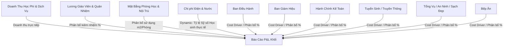

# CẨM NANG NGUYÊN LÝ VẬN HÀNH & PHÂN BỔ TÀI CHÍNH
## HỆ THỐNG COST ALLOCATION - XANH TUỆ ĐỨC

Tài liệu này mô tả chi tiết phương pháp luận tài chính, nguyên lý tính toán chi phí và phân định doanh thu được lập trình cốt lõi trong **Hệ thống Cost Allocation Xanh Tuệ Đức**. Cẩm nang được thiết kế nhằm giúp Ban Giám hiệu, Bộ phận Tài chính - Kế toán và Hội đồng Quản trị dễ dàng nắm bắt bản chất các con số xuất hiện trên P&L Dashboard.

---

---

## Ⅰ. NGUYÊN LÝ PHÂN ĐỊNH DOANH THU (REVENUE RECOGNITION)

Doanh thu trong hệ thống được xác định theo nguyên tắc **Trực tiếp & Độc lập** cho 4 khối trực tiếp (Revenue Centers):
1. **Khối Tiểu học**
2. **Khối THCS**
3. **Khối THPT**
4. **Ban Nội trú**

### 📌 Nguyên lý xác định:
* Doanh thu của từng khối (bao gồm học phí, phí dịch vụ bán trú, phí xe đưa đón và các khoản thu sự nghiệp khác) được thu trực tiếp từ học sinh của khối đó.
* Doanh thu được nhập thủ công hàng tháng tại Tab **"Quản lý Phòng Ban"**.
* Hệ thống **không phân bổ chéo doanh thu** giữa các khối nhằm đảm bảo tính độc lập và phản ánh chính xác quy mô thương mại thực tế của từng khối học.

---

## Ⅱ. NGUYÊN LÝ PHÂN BỔ CHI PHÍ LƯƠNG NHÂN SỰ (PAYROLL COST ALLOCATION)

Quỹ lương là khoản chi lớn nhất và được bóc tách theo nguyên lý **Cơ hữu đơn khối & Kiêm nhiệm đa ban**:

### 1. Nhân sự Cơ hữu Đơn ban (Permanent Staff)
* **Nguyên lý:** Là nhân sự làm việc cố định 100% thời gian cho một bộ phận (Ví dụ: Giáo viên chỉ dạy khối THPT, kế toán viên chỉ làm HCKT).
* **Hạch toán:** 100% lương của nhân sự này được tính thẳng làm **Chi phí lương trực tiếp** của khối đó (nếu là khối học trực tiếp) hoặc **Quỹ lương gián tiếp** của bộ phận đó (nếu là ban hỗ trợ).

### 2. Nhân sự Kiêm nhiệm Đa ban / Dạy chéo khối (Multi-level Staff)
* **Nguyên lý:** Là nhân sự kiêm nhiệm nhiều nhiệm vụ hoặc dạy chéo giữa các khối (Ví dụ: Thầy cô dạy cả Tiểu học và THCS, hoặc cán bộ quản lý phụ trách cả Nội trú).
* **Thuật toán Phân bổ (Weighted Split):** 
  * Người dùng thiết lập tỷ lệ phần trăm (%) kiêm nhiệm cho nhân sự đó chéo qua các phòng ban bất kỳ tại Tab **"Nhân sự & Bảng lương"**.
  * Quỹ lương thực tế gánh chịu bởi mỗi phòng ban được tính theo trọng số tương quan:
    $$\text{Lương Phân Bổ Về Ban } Y = \text{Lương Gốc} \times \left( \frac{\text{Tỷ lệ % gán cho Ban } Y}{\text{Tổng % đã gán cho tất cả các ban}} \right)$$
  * *Ưu điểm:* Thuật toán weighted-split thông minh giúp hệ thống luôn hoạt động chính xác kể cả khi tổng tỷ lệ nhập vào chưa đạt 100% (hệ thống tự động chia theo trọng số tương đối thực tế).

---

## Ⅲ. NGUYÊN LÝ PHÂN BỔ TIỀN THUÊ MẶT BẰNG (FACILITIES & RENT ALLOCATION)

Tiền thuê mặt bằng toàn trường được quản trị theo mô hình **Phân tách Dãy nhà & Chia phòng chức năng**:

### 1. Phân bổ tiền thuê Dãy nhà (Rent Blocks):
* Hệ thống quản lý các dãy nhà lớn (Nhà Hiệu bộ, Khu 10 phòng, Khu 8 phòng...) với tổng ngân sách thuê trần cố định hàng tháng.
* Giá trị thuê của từng phòng học đơn lẻ trong dãy được tính bằng cách chia đều tổng tiền thuê của dãy nhà đó cho số lượng phòng thực tế nằm trong dãy:
  $$\text{Tiền thuê mỗi phòng} = \frac{\text{Tổng tiền thuê dãy nhà}}{\text{Số lượng phòng trong dãy}}$$

### 2. Phân bổ sử dụng Phòng (Room Splits):
* Mỗi phòng học được thiết lập tỷ lệ (%) sử dụng của các phòng ban tại Tab **"Mặt bằng & Phòng học"**.
* Tiền thuê của phòng học đó sẽ được trôi về quỹ chi phí của phòng ban tương ứng theo tỷ lệ sử dụng được gán.
  * *Ví dụ:* Một phòng học có tiền thuê quy đổi là 4M/tháng, tỷ lệ gán cho THCS là 100% $\rightarrow$ THCS gánh trọn 4M chi phí mặt bằng trực tiếp.
  * *Ví dụ:* Thư viện dùng chung được gán Tiểu học: 33.3%, THCS: 33.3%, THPT: 33.4% $\rightarrow$ Tiền thuê thư viện sẽ tự động chia đều về chi phí mặt bằng gián tiếp gánh chịu của 3 khối.

### 3. Phân tách Phòng Học thường và Phòng Chức năng trong Giả lập:
Để đảm bảo tính trung thực và loại bỏ doanh thu ảo khi lập kịch bản dự phòng "What-If" lấp đầy phòng học, hệ thống phân tách rạch ròi 2 nhóm phòng học:
* **🏫 Nhóm Phòng học thường & Phòng nội trú (`classroom` / `boarding`):** Gánh chịu chi phí thuê mặt bằng phân bổ và tham gia trực tiếp vào tính toán sỹ số học sinh giả lập & tạo doanh thu học phí lấp đầy.
* **🛠 Nhóm Phòng chức năng / Dùng chung (`functional` - Ví dụ: Phòng Sáng tạo):** Vẫn nhận phân bổ chi phí tiền thuê mặt bằng về cho các khối để đảm bảo tính đúng đắn cho báo cáo P&L. Tuy nhiên, phòng chức năng **tuyệt đối không tính sỹ số giả lập lấp đầy** (sỹ số giả lập luôn bằng 0 và không nhân doanh thu học phí).

---

## Ⅳ. NGUYÊN LÝ PHÂN BỔ TIỆN ÍCH (ĐIỆN & NƯỚC)

Chi phí Điện và Nước là hai khoản vận hành lớn nhưng có tính chất tiêu dùng thực tế rất khác nhau. Hệ thống áp dụng 2 phương pháp phân bổ độc lập:

### 1. Chi phí Điện: Phân bổ theo số phòng sử dụng thực tế (Room-based Allocation)
* **Tư duy thực tế:** Bất kể một lớp học đông hay ít học sinh, mỗi khi lên lớp đều bật 2 máy điều hòa và hệ thống đèn tương đương nhau. Vì vậy, tiền điện được chia đều dựa trên số lượng phòng mà khối học đó đang gánh chịu chi phí sử dụng (quy đổi).
* **Công thức phân bổ:**
  $$\text{Tiền Điện phân bổ khối } Y = \text{Tổng hóa đơn Điện} \times \left( \frac{\text{Số phòng khối } Y \text{ đang dùng}}{\text{Tổng số phòng đang hoạt động}} \right)$$

### 2. Chi phí Nước: Phân bổ theo sỹ số học sinh thực tế (Student-Headcount Allocation)
* **Tư duy thực tế:** Nước sinh hoạt (uống, vệ sinh, bán trú...) chủ yếu được tiêu thụ trực tiếp theo đầu người. Khối nào có sỹ số học sinh đông hơn sẽ gánh vác phần tiền nước lớn tương ứng chéo theo sỹ số.
* **Công thức phân bổ:**
  $$\text{Tiền Nước phân bổ khối } Y = \text{Tổng hóa đơn Nước} \times \left( \frac{\text{Sỹ số thực tế khối } Y}{\text{Tổng sỹ số toàn trường}} \right)$$

---

## Ⅴ. NGUYÊN LÝ HỢP NHẤT & PHÂN BỔ BAN GIÁN TIẾP (SUPPORT OVERHEADS DEPLOYMENT)

Để lập báo cáo P&L đầy đủ cho từng khối, các phòng ban gián tiếp (Ban Điều hành, Ban Giám hiệu, Kế toán, Tuyển sinh...) bắt buộc phải được kết chuyển chi phí về các khối trực tiếp sinh doanh thu.

### 1. Gom cụm Chi phí (Consolidated Cost Pool)
Tổng chi phí trước phân bổ của mỗi ban gián tiếp được gom từ 2 nguồn:
$$\text{Cost Pool Ban Gián Tiếp } X = \text{Lương gián tiếp của ban X} + \text{Chi phí thuê mặt bằng của ban X}$$

### 2. Kết chuyển phân bổ về Khối Doanh thu
* Chi phí của Cost Pool sẽ được kết chuyển về P&L của 4 khối trực tiếp theo tỷ lệ % gán thủ công tại Tab **"Quản lý Phòng Ban"**.
* Công thức kết chuyển:
  $$\text{Chi phí ban gián tiếp } X \text{ gánh bởi khối học } Y = \text{Cost Pool Ban } X \times \text{Tỷ lệ % gán cho khối học } Y$$
* *Ưu điểm:* Phương pháp này giúp P&L Dashboard phản ánh chính xác **Lợi Nhuận Thuần Thực Tế** sau khi đã gánh đầy đủ bộ máy quản lý và vận hành chung của toàn hệ thống trường Xanh Tuệ Đức.

---

## 💡 CÁCH SỬ DỤNG HỆ THỐNG AN TOÀN & HIỆU QUẢ

1. **Tuần tự nhập liệu tối ưu:**
   * **Bước 1:** Cập nhật Sỹ số học sinh & Doanh thu thực tế hàng tháng tại Tab **"Quản lý Phòng Ban"**.
   * **Bước 2:** Cập nhật Lương và Tỉ lệ kiêm nhiệm tại Tab **"Nhân sự & Bảng lương"**.
   * **Bước 3:** Cập nhật Hóa đơn Điện & Nước tại Tab **"Quản lý Phòng Ban"**.
   * **Bước 4:** Quay lại Tab **"Dashboard & P&L"** để xem và phân tích kết quả kinh doanh.

2. **Cách tra cứu (Audit Trail):**
   * Nếu có bất kỳ thắc mắc nào về một con số chi phí phân bổ trên bảng P&L, hãy **click chuột trực tiếp vào con số đó**. Hệ thống sẽ mở ra pop-up giải trình chi tiết danh sách nhân viên cấu thành hoặc công thức toán học nhân chia tương ứng.
